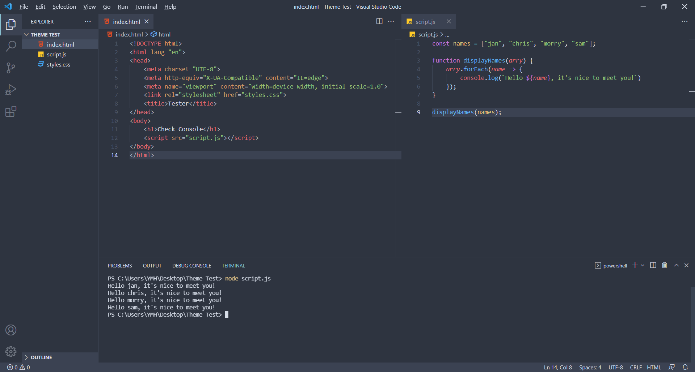

<p align="center">
    
</p>

---
<p align="center">
    Shell styling provided by <strong><a href="https://github.com/arcticicestudio/nord-visual-studio-code" target="_blank">NORD</a></strong>, syntax highlighting by <strong><a href="https://github.com/Binaryify/OneDark-Pro" target="_blank">ONE DARK PRO</a></strong>, continued theme enhancements by community.
</p>


## 💭 The Issue
___
Nord theme provides a beautiful and elegant arctic north-blueish color pallet. Although the theme provides a beautiful shell the syntax highlighting is very difficult to read.

This project aim's to fix that by using the Atoms One Dark Pro Syntax Highlighting within the Nord Theme's shell. This gives us the best of both worlds. A beautiful north blueish shell with the easy readability of One Dark Pro's Syntax legendary highlighting.


## 📸 Screenshots
___



## 🚩 Getting Started
___
Using the official VS Code Extension Marketplace, Nord+ can be installed with one click.

Open the extension marketplace by clicking on the Extensions icon in your Activity Bar. Search for ```Nord+``` and click on the Install button.


## ⭐ Credits
___
[Nord Visual Studio Code](https://github.com/arcticicestudio/nord-visual-studio-code) "An arctic, north-bluish clean and elegant Visual Studio Code theme."

[OneDark-Pro](https://github.com/Binaryify/OneDark-Pro) "Atom's iconic One Dark theme, and one of the most installed themes for VS Code!"