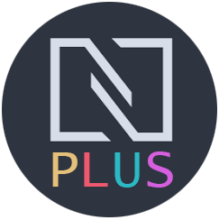

</br>

<p align="center">
    
</p>

</br>
<p align="center">
    Shell styling by <strong><a href="https://github.com/arcticicestudio/nord-visual-studio-code" target="_blank">Nord</a></strong>, syntax highlighting by <strong><a href="https://github.com/Binaryify/OneDark-Pro" target="_blank">One Dark Pro</a></strong>,</br> enhancements by community.
</p>

<p align="center">
    
</p>

## Issue
---
Nord theme provides a beautiful and elegant arctic north-blueish color pallet. Although the theme provides a beautiful shell, the syntax highlighting is lacking the necessary contrast to make the code readable.

This project aim's to fix that by using Atoms One Dark Pro Syntax Highlighting color pallette within the Nord theme shell.

## Screenshot
---


</br>


## Getting Started
---
Using the official VS Code Extension Marketplace, Nord+ can be installed with one click.

Open the extension marketplace by clicking on the Extensions icon in your Activity Bar. Search for ```Nord+``` and click on the Install button.

## Attribution & Credits
---
[Nord Visual Studio Code](https://github.com/arcticicestudio/nord-visual-studio-code) "An arctic, north-bluish clean and elegant Visual Studio Code theme."

[OneDark-Pro](https://github.com/Binaryify/OneDark-Pro) "Atom's iconic One Dark theme, and one of the most installed themes for VS Code!"